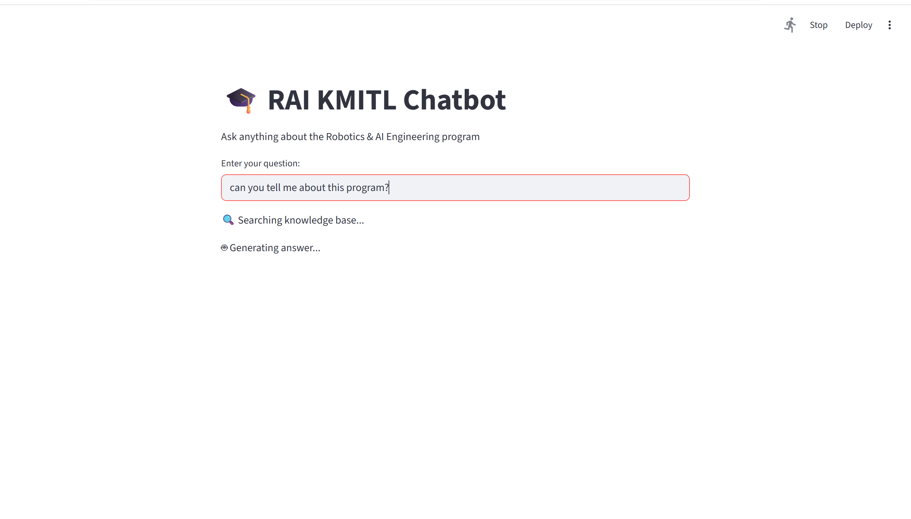

# 🎓 RAI KMITL Chatbot (RAG-based AI Assistant)

A Retrieval-Augmented Generation (RAG) chatbot designed for the **Robotics & AI Engineering program at KMITL**.  
It allows users to ask questions about the program and receive AI-generated answers based on a custom knowledge base.

---

## ✨ Features

- 🔍 Semantic search using FAISS for relevant information retrieval  
- 🧠 AI-powered responses using OpenAI GPT models  
- 📚 Uses a custom knowledge base (`data.txt`)  
- 💬 Simple and interactive Streamlit chat interface  
- ⚡ Lightweight and easy to run locally  

---

## 🖼️ Demo

Below is a preview of the chatbot interface:




---

## ⚙️ How It Works

1. The user enters a question in the Streamlit interface  
2. The system retrieves relevant context from `data.txt` using FAISS  
3. The retrieved context is passed to the OpenAI model  
4. The model generates a grounded answer based only on the provided context  
5. The response is displayed in the chat interface  

---

## 🚀 Installation

```bash
#clone the repository
git clone <your-repo-url>
cd project

#install dependencies
pip install -r requirements.txt

#Set your OpenAI API key before running the project

#run the application
streamlit run app.py
